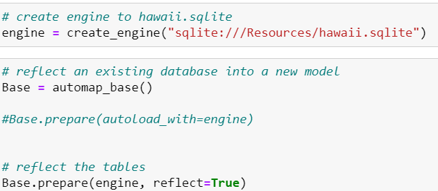
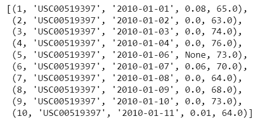
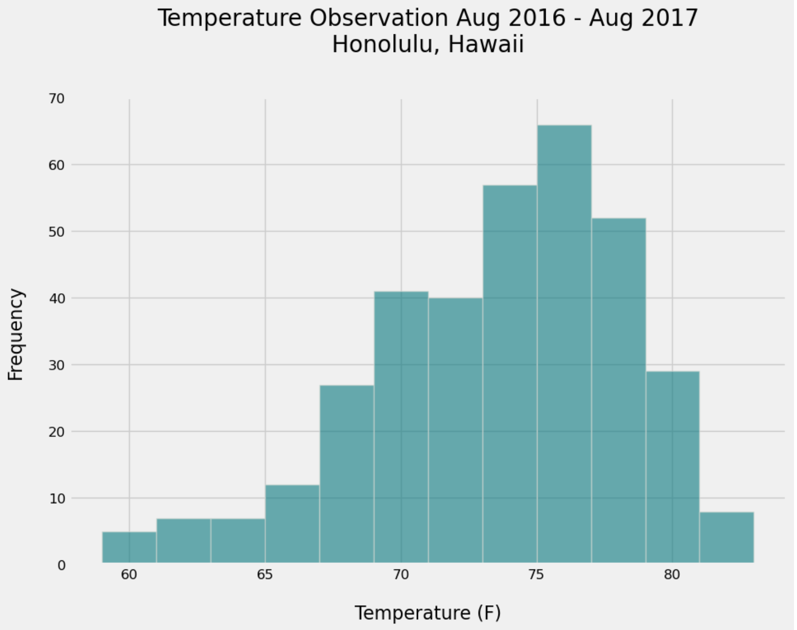

# Climate_Data_Exploration__Analysis
 Climate analysis and data exploration of a climate database

# Explore
Hey, let's explore the climate changes for a best holiday

### 1 Introduction 

- We have a sqlite databsse for the data of climate for a location to explore the data.

- Basis on the data analysis we can plan much better about in what days we cna go for the vacation holiday and what other preparations we need with respect to temperature changes in climate.

- We will use the Jupyter Notebook for data exploration and also create a Flask app to display the information in json format using API.

### 2 Prerequisites

-  Python and SQLAlchemy use to do a basic climate analysis and data exploration of our climate database.

-  Specifically, we use SQLAlchemy ORM queries, Pandas, and Matplotlib.

### 3 Explore the Climate Data

#### 3.1 Connection to Database

Use the SQLAlchemy create_engine() function to connect to my SQLite database.

Use the SQLAlchemy automap_base() function to reflect your tables into classes, and then save references to the classes named station and measurement.

Link Python to the database by creating a SQLAlchemy session.

#### 3.2 Inspection of Tables

Two tables are identified by the inspection of the database and here is the data in first 10 rows.

##### 3.2.1 Measurement Table

##### 3.2.2 Station Table

### 4 Exploratory Analysis

The analysis for the precipitation and station table is performed.

#### 4.1 Precipitation Analysis

Precipitation analysis using the bar plot shows the summary of the percipitation data. (Sorted by Date)

#### 4.2 Station Analysis

Station analysis display the temperature observations of the data from August 2016 to August 2017. 

### 5 Flask API for Climate Data

A climate flask app.py is  created and sets different routes for different results. I use the Flask jsonify function to convertAPI data to a valid JSON response object.

#### 5.1 Home Route

List all the available routes.

#### 5.2 Percipitation ( /api/v1.0/precipitation )

Convert the query results from your precipitation analysis (i.e. retrieve only the last 12 months of data) to a dictionary using date as the key and prcp as the value.

#### 5.3 Stations ( /api/v1.0/stations )

Return a list of stations from the dataset.

#### 5.4 Temperature Observations  ( /api/v1.0/tobs )

Query the dates and temperature observations of the most-active station for the previous year of data.

#### 5.5 Dyanmic Route for Start/End Date 

##### ( /api/v1.0/<start> and /api/v1.0/<start>/<end>  )

- Return a JSON list of the minimum temperature, the average temperature, and the maximum temperature for a specified start or start-end range.

- For a specified start, calculate TMIN, TAVG, and TMAX for all the dates greater than or equal to the start date.

- For a specified start date and end date, calculate TMIN, TAVG, and TMAX for the dates from the start date to the end date, inclusive.

- When the user provide the start/end date in either wrong format or out of range of the dataset. API shows the prompt:

### 6 Conclusion

We can the information about the climate as the data exploration & routes Flask API provides results successfully.
